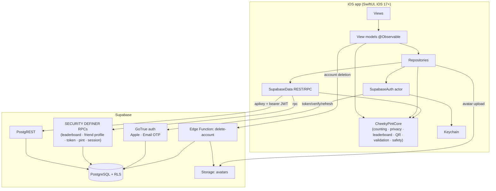
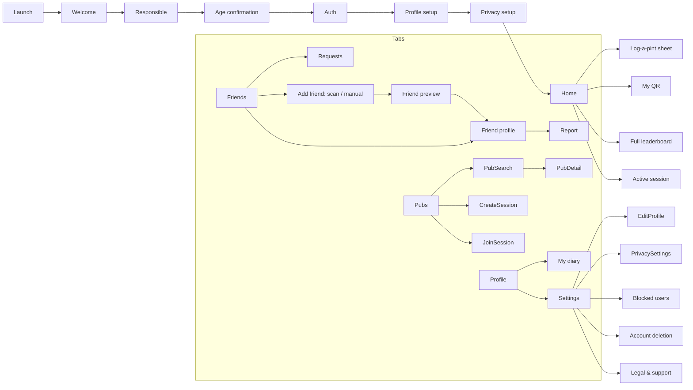

# Architecture

## Principles

1. **One source of truth for rules.** Counting, period math, privacy, leaderboard ranking,
   validation, QR tokens, and welfare/abuse logic live in the `CheekyPintCore` Swift package —
   Foundation-only, deterministic, and exhaustively unit-tested on macOS without Xcode.
2. **Defence in depth.** The backend re-enforces the same privacy/counting rules with Row Level
   Security and `SECURITY DEFINER` functions. The client never sees another user's raw rows.
3. **Thin, testable app.** SwiftUI views are dumb; `@Observable` view models orchestrate;
   repositories wrap the Supabase client and map to the tested core models.
4. **Minimal dependencies.** Native Apple frameworks + a hand-rolled Supabase REST/Auth client.
   No third-party iOS SPM packages in the MVP.

## Layers

The same domain package (`CheekyPintCore`) is used by the app to *compute* period windows and
*present* leaderboards, while the database *aggregates* using windows the client passes in — so
the tested calendar math is authoritative and never re-implemented in SQL.

## Module map (app)

- `App/` — `CheekyPintApp` (entry), `AppContainer` (composition root), `SessionController`
  (phase machine: loading → signedOut → onboarding → ready), `RootView`.
- `Core/Networking` — `AppConfig`, `SupabaseData` (PostgREST + RPC + storage), JSON coding, errors.
- `Core/Authentication` — `SupabaseAuth` (actor), `AuthSession`, `KeychainStore`.
- `Core/Database` — repositories + RPC contracts (Profile, Diary, Friends, Leaderboard, Pubs, Sessions).
- `Core/DesignSystem` — tokens (`Theme`), button styles, `RemoteAvatar`, `StatusView`.
- `Core/{Analytics,Location,QR,Utilities}` — services (privacy-preserving analytics, on-demand
  When-In-Use location, QR generate/scan, haptics, nonce, image resize).
- `Features/*` — one folder per feature, each with its views (+ view model where stateful).

## Screen map

## Key flows

- **Log a pint:** sheet generates a stable `IdempotencyKey` on open → `create_pint_entry` RPC
  (server timestamp, session-membership check, dedupe on `(user_id, idempotency_key)`) → local
  totals recomputed by `PersonalTotalsCalculator` → welfare tone chosen by `WelfareMonitor` →
  undo soft-deletes via `undo_recent_pint_entry`.
- **Add a friend:** `regenerate_friend_token` returns a raw token (cached in Keychain) rendered
  as `cheekypint://friend/<token>` → scanned/entered → `resolve_friend_token` returns a safe
  preview → `send_friend_request` → `respond_to_friend_request`.
- **Leaderboard:** client computes the `[start,end)` window with `PeriodCalculator` →
  `get_friend_leaderboard(start,end,kind,session)` returns per-friend totals or a private marker
  → `LeaderboardBuilder` ranks (competition ranking, current user always in preview).
