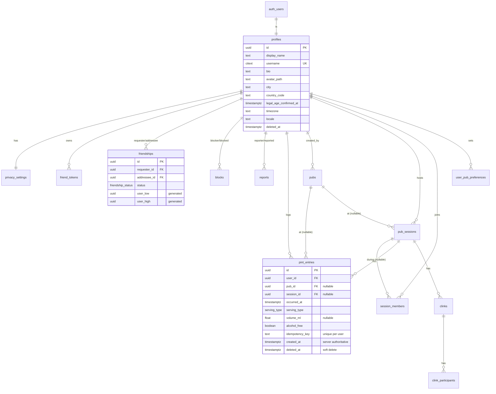

# Database

PostgreSQL (Supabase). Migrations are in `supabase/migrations/`, applied in filename order.
Verify locally with `supabase db reset` or `supabase/tests/run_local_pg.sh`.

## Entity diagram

Full column lists are in the migrations; only the counting-critical columns are shown above.

## Enums

`visibility (private|friends)` · `friendship_status (pending|accepted|declined|removed)` ·
`session_status (active|ended)` · `session_member_role (host|member)` · `pub_source` ·
`entry_source` · `serving_type (half_pint|pint|ml_330|ml_500|custom)` · `report_category` ·
`report_status`. **No `public` visibility exists** — the most a value is shared is with friends.

## Integrity & lifecycle

- **Idempotency:** unique `(user_id, idempotency_key)` on `pint_entries`; `create_pint_entry`
  upserts with `on conflict do nothing` and returns the existing row on retry.
- **Soft deletion:** `deleted_at` on profiles, pint_entries. Undo and account-deletion set it;
  aggregates always filter `deleted_at is null`.
- **Duplicate-friendship guard:** generated `user_low`/`user_high` + a partial unique index on
  `(user_low, user_high) where status in ('pending','accepted')`.
- **Server timestamps:** `created_at` defaults to `now()`; `updated_at` maintained by the
  `set_updated_at` trigger. The device clock (`occurred_at`) is user-adjustable but validated
  (no far-future entries).
- **Bootstrap:** `handle_new_user` trigger creates `profiles` + `privacy_settings` on signup.

## Counting rules (authoritative)

A pint entry counts toward a period total when **all** hold:

1. `deleted_at is null` (not undone);
2. `occurred_at` is inside the half-open window `[start, end)`;
3. it belongs to the relevant user;
4. `alcohol_free = false` (alcohol-free is excluded from alcohol totals by default; it still
   appears in the personal diary, clearly labelled);
5. for the **session** period only, `session_id = <the active session>`.

The MVP leaderboard number is **entries recorded** ("pints recorded"), while `serving_type` /
`volume_ml` are preserved so a standardised-servings basis (UK-pint equivalent) can be switched
on later without a data migration. Windows are **calendar-aware** and computed client-side by
`PeriodCalculator` (locale first-weekday, local month/year, DST- and timezone-correct), then
passed to `get_friend_leaderboard(start, end, kind, session)`.

## Row Level Security (summary)

Direct table access is **own-rows only**; every cross-user read goes through a
`SECURITY DEFINER` RPC that applies privacy + block rules. Highlights:

- `pint_entries`: `SELECT` self only; no direct `INSERT`/`UPDATE` (RPC-only) — so rate limits,
  server timestamps, and session checks can't be bypassed.
- `profiles`/`privacy_settings`: `SELECT`/`UPDATE` self only. Friends' names/avatars/profiles
  come from `get_friends` / `get_friend_profile`, which return only permitted columns.
- **Blocks override everything** via `is_blocked(a,b)`, checked before any friendship/session rule.
- `rate_limit_events`: RLS on with **no policies** → only `enforce_rate_limit` (definer) touches it.

See [SECURITY.md](SECURITY.md) and the allow/deny suite in `supabase/tests/`.

## RPC surface

`regenerate_friend_token` · `resolve_friend_token` · `send_friend_request` ·
`respond_to_friend_request` · `remove_friend` · `block_user` · `unblock_user` · `report_user` ·
`get_friends` · `get_pending_requests` · `get_friend_profile` · `get_friend_leaderboard` ·
`get_favourite_pubs` · `get_blocked_users` · `create_pint_entry` · `undo_recent_pint_entry` ·
`create_pub_session` · `join_session_by_token` · `leave_session` · `end_session` · `create_clink` ·
`delete_account`. All are `SECURITY DEFINER`, `set search_path = ''`, and granted to
`authenticated` only (internal helpers are revoked).

## Query performance notes

- **Leaderboard:** for each participant, a single indexed count over
  `pint_entries_user_occurred_idx (user_id, occurred_at desc) where deleted_at is null`. Friend
  set is small (personal social graph), so this is N small index range scans, not a global scan.
- **Favourite pubs:** grouped aggregate over `pint_entries_pub_idx (user_id, pub_id) where
  pub_id is not null and deleted_at is null`, limited to 5.
- **Personal history:** keyset pagination on `(user_id, occurred_at desc)` via `before` cursor.
- Prune `rate_limit_events` periodically (`prune_rate_limit_events`, e.g. a daily cron).
